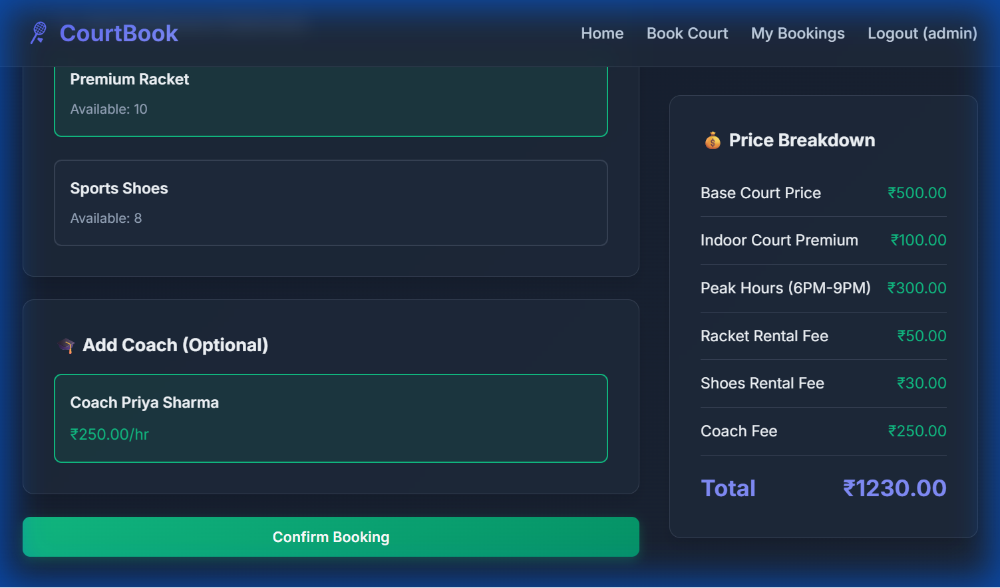

# Badminton Court Booking System

A full-stack Django web application for booking badminton courts with optional equipment rental and coach services. Features dynamic pricing based on configurable rules and atomic multi-resource booking.

## Features

- **Multi-Resource Booking**: Book courts with optional equipment and coaches
- **Dynamic Pricing Engine**: Configurable pricing rules (peak hours, weekends, indoor premium, etc.)
- **Atomic Transactions**: All-or-nothing booking to prevent partial reservations
- **Concurrent Booking Prevention**: Database-level locking prevents double bookings during simultaneous requests
- **Waitlist System**: Join waitlist when slots are full; automatic notification on cancellation
- **Real-time Availability**: Check court, equipment, and coach availability instantly
- **Live Price Calculation**: See price breakdown update as you select options
- **Admin Panel**: Manage courts, equipment, coaches, and pricing rules
- **User Authentication**: Secure registration and login system
- **Booking History**: View all past and upcoming bookings
- **Booking Cancellation**: Cancel bookings with automatic waitlist notification

## Screenshots

### Booking Interface
The booking interface features a clean, modern dark theme with live price calculation as you select resources.



**Key Features Shown:**
- Date and time slot selection
- Court selection with availability indicators
- Equipment rental options (Rackets, Shoes)
- Coach selection with availability
- **Live Price Breakdown** showing:
  - Base Court Price: ₹500
  - Indoor Court Premium: +₹100 (20%)
  - Peak Hours Premium: +₹300 (50%)
  - Weekend Premium: +₹270 (30%)
  - Equipment Fee: +₹50
  - Coach Fee: +₹250
  - **Total: ₹1,470**

### Application Flow

1. **Home Page** - Landing page with authentication options
2. **Booking Interface** - Select date, time, court, equipment, and coach
3. **Live Pricing** - Real-time price updates as you make selections
4. **Booking History** - View all your bookings and waitlist entries
5. **Admin Panel** - Manage courts, equipment, coaches, and pricing rules

## Tech Stack

- **Backend**: Django 4.2.27
- **Frontend**: Django Templates + Vanilla JavaScript
- **Styling**: Custom CSS with modern design system
- **Database**: SQLite (development), PostgreSQL-ready schema

## Project Structure

```
CourtBookingSystem/
├── badminton_booking/          # Django project settings
│   ├── settings.py
│   ├── urls.py
│   └── wsgi.py
├── booking/                    # Core booking app
│   ├── models.py              # Database models
│   ├── views.py               # Views and API endpoints
│   ├── admin.py               # Admin configuration
│   ├── services/              # Business logic
│   │   ├── availability.py    # Availability checking
│   │   ├── pricing.py         # Dynamic pricing engine
│   │   └── waitlist.py        # Waitlist management
│   ├── management/commands/   # Management commands
│   │   └── seed_data.py       # Database seeding
│   └── templates/             # HTML templates
├── static/                     # CSS and JavaScript
│   ├── css/style.css
│   └── js/
├── db.sqlite3                 # SQLite database
├── manage.py
├── requirements.txt
└── README.md
```


## Setup Instructions

### Prerequisites

- Python 3.8 or higher
- pip (Python package manager)

### Installation

1. **Clone or navigate to the project directory**:
   ```bash
   cd "c:\Users\CourtBookingSystem"
   ```

2. **Install dependencies**:
   ```bash
   pip install django
   ```

3. **Run migrations** (already done, but for reference):
   ```bash
   python manage.py migrate
   ```

4. **Seed the database with initial data**:
   ```bash
   python manage.py seed_data
   ```

   This creates:
   - 4 courts (2 indoor, 2 outdoor)
   - 2 equipment types (rackets, shoes)
   - 3 coaches with availability schedules
   - 6 pricing rules
   - Admin user (username: `admin`, password: `admin123`)

5. **Run the development server**:
   ```bash
   python manage.py runserver
   ```

6. **Access the application**:
   - **Homepage**: http://127.0.0.1:8000/
   - **Admin Panel**: http://127.0.0.1:8000/admin/
   - **Login**: admin / admin123

## Usage Guide

### For Users

1. **Register an Account**: Click "Register" and create your account
2. **Book a Court**:
   - Select a date (up to 7 days in advance)
   - Choose a time slot
   - Pick an available court
   - Optionally add equipment (rackets, shoes)
   - Optionally select a coach
   - Review the live price breakdown
   - Confirm your booking
3. **View Bookings**: Check "My Bookings" to see your booking history

### For Admins

1. **Login to Admin Panel**: http://127.0.0.1:8000/admin/
2. **Manage Resources**:
   - Add/edit/disable courts
   - Update equipment quantities
   - Manage coach profiles and availability
3. **Configure Pricing**:
   - Enable/disable pricing rules
   - Adjust multipliers and fees
   - Set rule priorities
4. **View Bookings**: Monitor all bookings with detailed information

## Database Design

### Core Models

1. **Court**: Represents badminton courts (indoor/outdoor)
2. **Equipment**: Rental equipment with quantity tracking
3. **Coach**: Coaches with hourly fees
4. **CoachAvailability**: Weekly schedule for each coach
5. **PricingRule**: Configurable pricing rules with conditions
6. **Booking**: Court reservations with multi-resource support
7. **BookingEquipment**: Through-table for equipment quantities
8. **Waitlist**: Queue system for fully booked slots

### Key Design Decisions

- **Atomic Bookings**: Using Django transactions to ensure all resources are available before confirming
- **Concurrent Booking Prevention**: `select_for_update()` locks prevent race conditions during simultaneous booking attempts
- **Waitlist Queue**: FIFO (First-In-First-Out) ordering based on `created_at` timestamp
- **Automatic Notifications**: On cancellation, next person in waitlist is automatically notified
- **Availability Tracking**: Equipment quantities calculated dynamically from active bookings
- **Price Breakdown Storage**: JSON field stores complete pricing calculation for audit trail
- **Flexible Scheduling**: Coach availability defined as weekly patterns


## Pricing Engine Approach

### Architecture

The pricing engine is completely **configuration-driven** with no hardcoded logic:

1. **Base Price**: ₹500 per hour slot (configurable in `PricingEngine.BASE_COURT_PRICE`)
2. **Rule Types**:
   - `PEAK_HOURS`: Time-based multiplier (e.g., 6 PM - 9 PM)
   - `WEEKEND`: Day-based multiplier (Saturday, Sunday)
   - `INDOOR_PREMIUM`: Court type multiplier
   - `EQUIPMENT_FEE`: Flat fee per equipment item
   - `COACH_FEE`: Uses coach's hourly fee

3. **Rule Stacking**: Rules are applied sequentially by priority
   - Percentage rules compound on current price
   - Flat fees are added directly
   - Example calculation:
     ```
     Base: ₹500
     + Indoor (20%): ₹100 → ₹600
     + Peak Hours (50%): ₹300 → ₹900
     + Weekend (30%): ₹270 → ₹1170
     + Racket: ₹50 → ₹1220
     + Coach: ₹200 → ₹1420
     ```

4. **Admin Control**: All rules can be enabled/disabled and modified through admin panel

### Implementation

- **Service Layer**: `PricingEngine` class in `booking/services/pricing.py`
- **Dynamic Calculation**: Pricing calculated on-demand based on enabled rules
- **Transparency**: Complete breakdown stored with each booking

## Assumptions Made

1. **Time Slots**: Fixed 1-hour slots from 6 AM to 10 PM
2. **Booking Window**: Users can book up to 7 days in advance
3. **Equipment Rental**: Charged per booking (not hourly)
4. **Coach Availability**: Defined as weekly recurring patterns
5. **Concurrent Bookings**: Prevented using database-level row locking (`select_for_update()`)
6. **Waitlist Notifications**: Currently logged to console (in production would send email/SMS)
7. **Waitlist Expiry**: Notifications expire after 24 hours (requires periodic cleanup)
8. **Pricing Calculation**: Rules applied in priority order with compounding


## API Endpoints

| Endpoint | Method | Description |
|----------|--------|-------------|
| `/` | GET | Home page |
| `/booking/` | GET | Booking interface |
| `/booking/history/` | GET | User's booking history |
| `/api/availability/` | GET | Check resource availability |
| `/api/calculate-price/` | POST | Calculate dynamic price |
| `/api/confirm-booking/` | POST | Create booking (atomic) |
| `/api/join-waitlist/` | POST | Join waitlist for full slot |
| `/api/remove-waitlist/` | POST | Remove from waitlist |
| `/api/cancel-booking/` | POST | Cancel booking (notifies waitlist) |
| `/accounts/login/` | GET/POST | User login |
| `/register/` | GET/POST | User registration |
| `/admin/` | GET | Django admin panel |


## Testing

### Manual Testing Checklist

1. **User Registration & Login**
   - ✓ Create new user account
   - ✓ Login with credentials
   - ✓ Logout functionality

2. **Booking Flow**
   - ✓ Select date and time slot
   - ✓ View available courts
   - ✓ Select court and see price update
   - ✓ Add equipment and verify price change
   - ✓ Select coach and verify availability
   - ✓ Confirm booking

3. **Availability Checking**
   - ✓ Book a slot and verify it's unavailable for others
   - ✓ Try booking when equipment is depleted
   - ✓ Try booking coach during unavailable hours

4. **Admin Panel**
   - ✓ Manage courts (add/edit/disable)
   - ✓ Update equipment quantities
   - ✓ Configure pricing rules
   - ✓ View booking records

5. **Concurrent Booking & Waitlist**
   - ✓ Test concurrent booking prevention
   - ✓ Join waitlist when slot is full
   - ✓ Cancel booking and verify waitlist notification
   - ✓ View waitlist entries in booking history

## License

This is a demonstration project for educational purposes.

## Contact

For questions or issues, please contact the development team.

